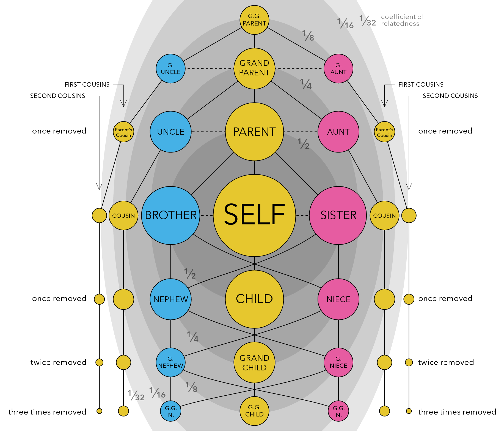

```{r, setup, include=FALSE}
knitr::opts_chunk$set(
  echo = TRUE, # Display code chunks
  eval = TRUE, # Evaluate code chunks
  warning = FALSE, # Hide warnings
  message = FALSE, # Hide messages
  comment = "") # Prevents appending '##' to beginning of lines in code output))      
```

# Background

Before this week's lab, please spend some time looking at the figure below to familiarize yourselves with the concept of **genetic relatedness,** which is defined as *the proportion of your DNA that you share with another individual*. Closer relatives share more of their DNA, and more distant relatives share less and less of it.



When we average across a population, or across all living things, we find that all individuals share roughly half (50%) of their DNA with their immediate relatives - that is, their parents, offspring, and full siblings (see the darkest grey ellipse in the center of the figure above). All of these relationships are therefore considered to have a ***relatedness coefficient*** of 0.5.

If we expand out to the next grey ellipse in the figure, which represents our next closest family members, we see that all individuals share roughly 1/4 (25%) of their DNA with these extended family relatives - that is, half-siblings, grandparents and grandchildren, and aunts/uncles or nephews/nieces. All of these relationships are therefore considered to have a ***relatedness coefficient*** of 0.25.

We can expand out again to the third largest grey ellipse in the figure, and we see that all individuals share roughly 1/8 (12.5%) of their DNA with these distant family relatives - that is, great-grandparents and great-grandchildren, great aunts and uncles, and great nieces and nephews. All of these relationships are therefore considered to have a ***relatedness coefficient*** of 0.125.

Scientists can use this information to build pedigrees and determine family relationships in wild populations using a combination of genetic data, age data, and sex data. For example, if you know that two individual California sea lions - one is a 17yo female and the other is a 5yo female - have a relatedness coefficient of 0.54, meaning that just over half of their DNA is identical, you may be able to determine that these two individuals are either parent-offspring or full siblings. Given the age difference between the two, there's a good chance that the older female is the mom and the younger female is the daughter.

What do you think is the relationship of the following individuals?

|                  |                  |                             |
|:----------------:|:----------------:|:---------------------------:|
| **Individual 1** | **Individual 2** | **Relatedness Coefficient** |
|    20yo male     |   10yo female    |            0.23             |
|   13yo female    |   10yo female    |            0.56             |
|    38yo male     |     4yo male     |            0.26             |

## Step 0: Set up environment

-   [Create an R project](https://support.posit.co/hc/en-us/articles/200526207-Using-RStudio-Projects)

-   Organize your project directory structure

Here is a simple example to start off:

```         
.
└── my_awesome_project
    ├── code
    │   └── my_code.Rmd
    ├── data
    │   ├── some_data.csv
    │   └── more_data.csv
    └── output
        └── figs
```

-   Open a new `.rmd` file in your `code` folder

-   Title & date your code file!

-   Load libraries

```{r}
library("tidyverse")
```

## Step 1: Import data

Now that you have your environment set up, the first thing you will want to do is import the data that you are working with. The most common way this is done is by reading in a comma-separated file (csv) or tab-delimited file (e.g. tsv or txt files). We are using a csv file for this exercise, so you can read in your data using read_csv() from the readr package:

```{r}
related <- read_csv("../data/SFPW_relatedness_associations.csv")
haplotypes <- read_csv("../data/SFPW_mtDNA_haplotypes.csv")
```

Once you have imported your data, take a look at it to make sure it makes sense. You can do this in two ways: first, in the environment window (upper right corner), find the variable called "search_data" and click on the blue arrow. This will show a drop-down summary of your data. You'll see each column listed as a vector, and it will show you the name of the column, the type or class of data, and the number of observations in each column.

You can also look at your data in the viewer. Click on the name of the data frame in the environment to open it up in the viewer window. Notice that it opens as a separate tab, and that each vector is shown as a column, with a row for each observation. In this case, we have three columns: one for month/year, one for the garden search term, and one for the ice skating search term. There are a total of 256 observations for each of those columns.

## Step 2: Wrangle your data

Usually, the data that you import won't be exactly what you want to plot or model. Sometimes it will require some tidying - for example, you may have incomplete observations (rows) that you need to remove, or inconsistent data entry that needs to be cleaned up. In this case, the first column imported a column of row numbers that are not useful for us. We can use a pipe operator `%>%` , which has a `Ctrl+Alt+p` default hotkey assigned in `Tools/Keyboard Shortcuts Help` followed by the command `dplyr::select` to select all columns except column 1 `(-1)` . This drops column 1 from our dataframe.

```{r}
related <- related %>% 
  dplyr::select(-1)

haplotypes <- haplotypes %>% 
  dplyr::select(-1)
```

Take some time to familiarize yourself with the data. Explore the columns, what information is present, and what questions you can ask of the data.

Functions like `head` , `summary`, and `str` are helpful for dataframe familiarization.

```{r}
head(related)
summary(related)
str(related)
```

```{r}
head(haplotypes)
summary(haplotypes)
str(haplotypes)
```

After exploring the data, we can see the individual pilot whales are described by cluster, island, and haplotype. Now we're ready to ask questions about the data.. Like: "What is the spread of relatedness coefficients within clusters? Are some clusters more closely related than others?" These questions can be specifically rephrased as hypothesis.

-   Write your hypotheses
    -   Null hypothesis (H0):
        -   All pilot whale clusters are equally related.
        -   There is no difference in relatedness among Hawaiian short-finned pilot whale clusters.
    -   Alternative hypothesis (H1a):
        -   Some pilot whale clusters are more incestuous than others.
        -   There is significant difference in relatedness in Hawaiian short-finned pilot whale clusters.

Begin with the end in mind: now that we have an idea of the end, we can wrangle our data further!

Keep within cluster comparisons:

```{r}
within_cluster <- related %>% 
  filter(clust1 == clust2)
```

Remove rows where the coefficient shows relatedness to self

```{r}
within_cluster <- within_cluster %>% 
  filter(!ind1 == ind2)
```

## Step 3: Visualize data

```{r}
ggplot(within_cluster,
       aes(x = factor(clust1),
           y = rel)) +
  geom_boxplot(outlier.alpha = 0.3) +
  geom_jitter(width = 0.15, alpha = 0.4, size = 1) +
  labs(
    x = "Cluster",
    y = "Relatedness coefficient"
  ) +
  theme_minimal()

```

Are any of these clusters more or less spread out on the y axis of relatedness than others? It's kind of hard to tell... But maybe cluster 4 and 5 are less spread than, say, cluster 15. We can do a quick statistical test on this with Levene's test for initial exploration.

## Step 4: Model data

```{r, eval=FALSE}
car::leveneTest(rel ~ clust1, data= within_cluster)
```

Make `clust1` a factor

```{r}
within_cluster <- within_cluster %>% 
  mutate(clust1 = factor(clust1))
```

Try to model with `leveneTest` again

```{r}
car::leveneTest(rel ~ clust1, data= within_cluster)
```

Here we see that Levene's test for variance is not significant, indicating that variances of relatedness clusters are similar. Aka.. each cluster is similarly "incestuous", or "inbred". What does it say that each cluster has an average relatedness coefficient of 0.6?
