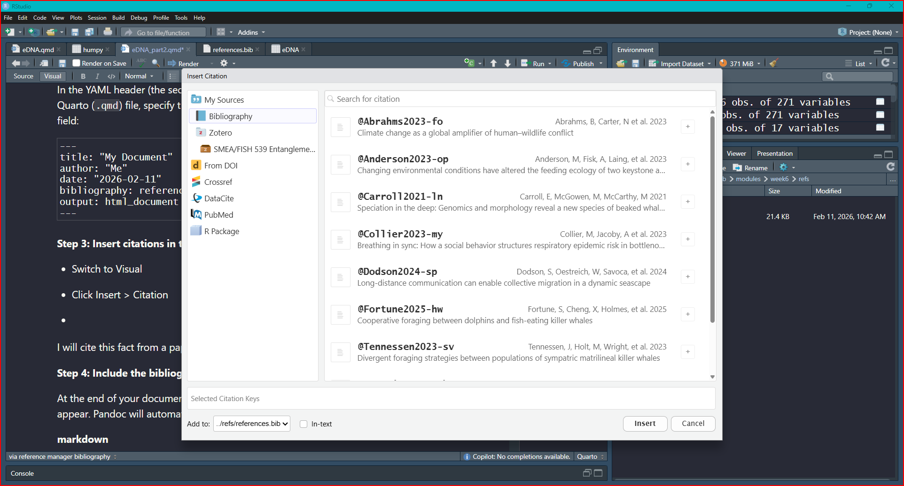

```{r setup}
knitr::opts_chunk$set(
  echo = TRUE,
  message = FALSE,
  warning = FALSE
  )
```

# Background

This week you will work in your groups to build on the eDNA data
exploration we did in week 5 to generate specific hypotheses about eDNA
distributions of marine mammals (and their prey)[@Anderson2023-op]. We
will also practice hiding code chunks and integrating citations into our
writing.[@Carroll2021-ln]

::: callout-important
-   eDNA data for fish prey species is proportional to the number of DNA
    reads that mapped to that fish species in the SEAWATER SAMPLE, which
    is not a direct measure of abundance but can be used as a proxy for
    relative abundance. IT IS NOT DIET COMPOSITION!
:::

```{r, include=FALSE}
library(tidyverse)
#installing marmap can take 30-60 seconds
#make sure R is up to date (v 4.0.x) with "version" in console
library(raster) # for working with spatial data, dependency for marmap
library(marmap) # for bathymetry data
library(PNWColors)
library(colorspace)
```

```{r, include=FALSE}
eDNA <- read_csv("../../week5/data/eDNA_MM_fish_detections_clean.csv")
```

```{r, include=FALSE}
eDNA_positive <- eDNA %>% 
  filter(Detected == 1)
```

```{r, include=FALSE}
lon1 <- max(eDNA$lon) + 2
lon2 <- min(eDNA$lon) - 1

lat1 <- min(eDNA$lat) - 2
lat2 <- max(eDNA$lat) + 2
```

```{r, include=FALSE}
bathy_map <- getNOAA.bathy(lon1=lon1, lon2=lon2, lat1=lat1, lat2=lat2,
            resolution=1, keep=TRUE) 
```

```{r, include=FALSE}
#create a ggplot object appropriate to the bathy data object
base_map <- autoplot.bathy(bathy_map, geom=c('raster'),
                show.legend=FALSE) +     #turn off legend
  scale_fill_etopo()                   #special topographic colors
  
```

# Predator prey eDNA presence relationships

... IF your group didn't explore this last week start here!

::: callout-important
Here we can use `group_by()` combined with `filter()` for fish species
that have an average proportion of reads greater than **a specified
percent** when the marine mammal is detected or not detected.

`filter(mean(prey_prop) > 0.02)` means that we are only keeping fish
species where the average proportion of reads that mapped to that fish
species is greater than 2% when the marine mammal is detected or not
detected.

Play around with the percent threshold to see how it changes the number
of fish species that are included in the plot! Too high and you filter
out meaningful data? Too low and you have too many fish species to
visualize!
:::

```{r}
humpy <- eDNA %>% 
  filter(common_name == "humpback whale") %>% 
  pivot_longer(16:length(.), names_to = "prey_species", values_to = "prey_prop") %>% 
  group_by(Detected, prey_species) %>%
  filter(mean(prey_prop) > 0.01) %>% # !!!!
  ungroup()
```

## Plot prey species proportions vs predator presence

Here we use `ggplot()` with `geom_boxplot()` and `facet_wrap()` to
create boxplots of prey species proportions when the predator is
detected vs not detected. Work together within and across groups to try
and recreate this plot!

::: callout-tip
`x = prey_species` and `y = prey_prop` from the wrangled and filtered
data frame where `pivot_longer()` was used to make the new columns
`prey_species` reflect the fish species and `prey_prop` reflect the
proportion of DNA reads that mapped to that fish species.
:::

```{r fig.height=10}
ggplot(humpy, aes(x = as.factor(Detected), y = prey_prop)) +
  geom_boxplot(aes(fill = as.factor(Detected))) +
  theme(legend.position = "none") +
  facet_wrap(~prey_species) +
  scale_x_discrete() +
  theme_minimal()+
  theme(
      axis.text.x = element_text(size = 10, 
                               angle = 90, 
                               hjust = 1)
  ) +
  coord_flip() + 
  ylim(0,0.5)
```

## Plot predator and prey species spatial distribution

```{r, fig.height=12}
  base_map +
  
  geom_point(data = humpy, 
             aes(x=lon, y = lat, size = prey_prop, 
                 color = prey_species),
             alpha = 0.6)+
  
  geom_point(data = humpy %>% filter(Detected == 1), 
               aes(x=lon, y = lat),
               alpha = 0.5,
               color = "black",
               shape = 17)

```

# Specific Hypotheses with X and Y variables

Simple predator prey example:

**H~o~**: There is no significant relationship between the presence of
humpback whale eDNA and the presence of *Stenobrachius leucopsarus*
(Northern Lampfish) eDNA in seawater samples.

**H~a~**: Humpback whale eDNA is more likely to be detected when
[*Stenobrachius leucopsarus* (Northern
Lampfish)](https://www.fishbase.se/summary/Stenobrachius-leucopsarus)
eDNA is detected in larger relative abundance.

***X***: Presence of *Stenobrachius leucopsarus* (Northern Lampfish)
eDNA in seawater samples (proportional, bound from 0 to 1)

***Y***: Presence of humpback whale eDNA in seawater samples (binary:
detected vs not detected)

# Example figure for this hypothesis:

##### An aside on color palettes...

[Colorspace](https://colorspace.r-forge.r-project.org/)

```{r}
library(colorspace)
#colorspace::hcl_wizard()
```

```{r}
#colorspace::choose_palette()
```

[PNWColors](https://github.com/jakelawlor/PNWColors)

```{r}
library(PNWColors)
mycolors <- rev(pnw_palette("Bay", 2, type = "discrete"))
```

## `ggplot()`

-   `scale_color_manual()` controls the outline of your geom

-   `scale_fill_manual()` controls the fill of your geom

```{r fig.height=8}
ggplot(humpy %>% filter(prey_species == "Stenobrachius leucopsarus"), 
       aes(x = prey_prop, y = as.factor(Detected), fill = as.factor(Detected), color = as.factor(Detected))) +
  geom_point() +
  geom_boxplot(alpha = 0.5) +
  #coord_flip() +
  scale_color_manual(
    values = mycolors,
    name = "Whale eDNA",
    labels = c("Not detected", "Detected")
  ) +
  scale_fill_manual(
    values = mycolors,
    name = "Whale eDNA",
    labels = c("Not detected", "Detected")
  ) +
  theme_minimal() +
  labs(x = "Proportion of reads that mapped to Stenobrachius leucopsarus (Northern Lampfish) eDNA",
       y = "Humpback whale eDNA detected (1) or not detected (0)")
```

# Citation tips and tricks

You can manage citations in R Markdown using a bibliography file (e.g.,
.bib). If you have not had exposure to citation managers I *highly*
recommend them, they're worth the setup time!

Some free options are:

-   [Zotero](https://www.zotero.org/)

-   [Paperpile](https://paperpile.com/)

These tools allow you to collect and organize your references, and then
export them in a `.bib` file format that can be used in R Markdown.

**Step 1: Create a `.bib` file**

A `.bib` file is a plain text file that stores reference details in
BibTeX format.

**Step 2: Link the `.bib` file in your R Markdown document**

In the YAML header (the section between the `---` lines) of your R
Markdown (`.Rmd`) or Quarto (`.qmd`) file, specify the path to your
bibliography file using the `bibliography` field:

``` markdown
---
title: "My Document"
author: "Me"
date: "2026-02-11"
bibliography: references.bib
output: html_document
---
```

**Step 3: Insert citations in the text** 

-   Switch to Visual

-   Click Insert \> Citation

    

-   Select Bibliography

-   Click the `+` sign to add the citation where your cursor sits in
    your `.Rmd` file

I will cite this fact from a paper [@Abrahms2023-fo]

**Step 4: Include the bibliography section**

At the end of your document, add a section header where the bibliography
should appear. Pandoc will automatically generate the reference list:

::: callout-tip
## Learn more about citations in Visual R Markdown from [this guide page](https://rstudio.github.io/visual-markdown-editing/citations.html)
:::

# Report formatting tips and tricks

## The global setup chunk!

``` markdown
{r setup}
knitr::opts_chunk$set(
  echo = TRUE,
  message = FALSE,
  warning = FALSE
  )
```

Paste this code chunk into your .Rmd file! The global setup code chunk
controls the default settings for **all code chunks in your report**.
`TRUE` = *show it*, `FALSE` = *hide it*. In the above example global
setup chunk, we have set:

-   `echo = TRUE` to show the code in the report

-   `message = FALSE` to hide any messages

-   `warning = FALSE` to hide warnings that may be generated by the code

You can adjust these settings individually on a chunk by chunk basis by
typing inside the {r} at the beginning of each code chunk. For example,
if you want to hide the code and its output for a specific chunk, you
can set {r,`include = FALSE`} for that chunk.

## yaml front matter

Checkout html or PDF format options
[here](https://quarto.org/docs/reference/formats/html.html)

# Week 6 Lab Report should include:

1.  Background information on chosen predator (e.g. diet, distribution,
    habitat use, competitors, predators)

2.  Citations

3.  Finalized Broad Research Question

4.  Finalized Specific Research Question (if needed)

5.  Finalized Falsifiable Null and Alternate Hypotheses (be specific)

6.  Defined X and Y variables

7.  Preliminary figure(s) showing X and Y variables.

# References
