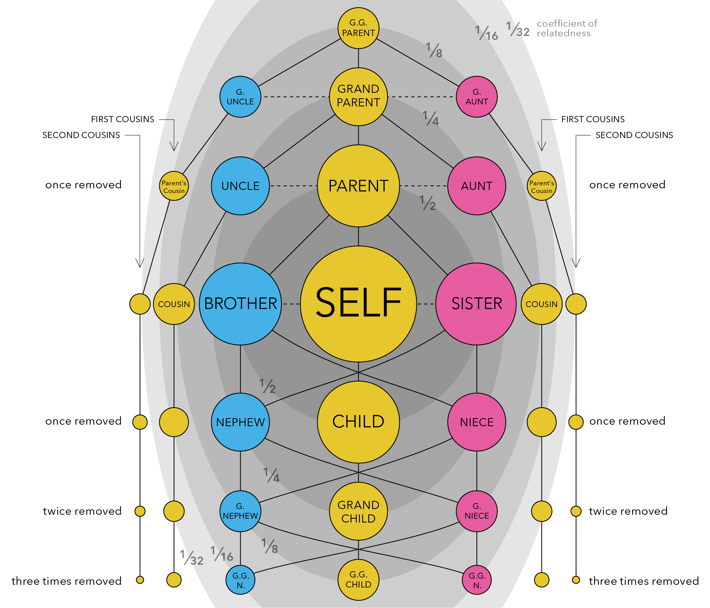

# The scientific method

# Review R, tidyverse, and markdown

## Review R coding

#### Learning Goals:

1.  Learn to use the R tidyverse to import data and perform basic data tidying and manipulation.

2.  Learn to use the ggplot package in R to create basic plots of your data.

For this week's lab, I will expect that you have a basic understanding of R, including how to open R, define variables/objects, use basic R vocabulary (e.g. vectors, matrices, and dataframes), and write code using an Rscript or Rmarkdown file. Please review any of these topics that feel unfamiliar to you, using the following videos (from the [Cradle to GraveRLinks to an external site.](https://www.youtube.com/@CradleToGraveR) YouTube Channel) as needed:

1.  [R for beginners](https://youtu.be/oYopG3UBr-U?si=Q6tqVXJRcFmWvUUa) (\~10 min)

2.  [Rmarkdown Part 1](https://youtu.be/W3sC_M1miFc?si=-7l-SLubktOcMGVY) (\~10 min)

3.  [Rmarkdown Part 2](https://youtu.be/j7Xo7xFA3Bg?si=tBMosA7ZRpU0MUJv) (\~10 min)

4.  [Vectors and Functions](https://youtu.be/bCLlT44WR4g?si=eAaSraL2ex-IjMjz) (\~10 min)

5.  [Importing .csv files using tidyverse](https://www.youtube.com/watch?v=ds6vNpcCZ8c) (\~10 min) \<- Everyone should watch at least this video!

These videos will work best if you follow along with the exercises in R.

# Population structure in Hawaiian pilot whales

## Background

Before this week's lab, please spend some time looking at the figure below to familiarize yourselves with the concept of **genetic relatedness,** which is defined as *the proportion of your DNA that you share with another individual*. Closer relatives share more of their DNA, and more distant relatives share less and less of it.

When we average across a population, or across all living things, we find that all individuals share roughly half (50%) of their DNA with their immediate relatives - that is, their parents, offspring, and full siblings (see the darkest grey ellipse in the center of the figure above). All of these relationships are therefore considered to have a ***relatedness coefficient*** of 0.5.

If we expand out to the next grey ellipse in the figure, which represents our next closest family members, we see that all individuals share roughly 1/4 (25%) of their DNA with these extended family relatives - that is, half-siblings, grandparents and grandchildren, and aunts/uncles or nephews/nieces. All of these relationships are therefore considered to have a ***relatedness coefficient*** of 0.25.

We can expand out again to the third largest grey ellipse in the figure, and we see that all individuals share roughly 1/8 (12.5%) of their DNA with these distant family relatives - that is, great-grandparents and great-grandchildren, great aunts and uncles, and great nieces and nephews. All of these relationships are therefore considered to have a ***relatedness coefficient*** of 0.125.

Scientists can use this information to build pedigrees and determine family relationships in wild populations using a combination of genetic data, age data, and sex data. For example, if you know that two individual California sea lions - one is a 17yo female and the other is a 5yo female - have a relatedness coefficient of 0.54, meaning that just over half of their DNA is identical, you may be able to determine that these two individuals are either parent-offspring or full siblings. Given the age difference between the two, there's a good chance that the older female is the mom and the younger female is the daughter.

What do you think is the relationship of the following individuals?

|                  |                  |                             |
|:----------------:|:----------------:|:---------------------------:|
| **Individual 1** | **Individual 2** | **Relatedness Coefficient** |
|    20yo male     |   10yo female    |            0.23             |
|   13yo female    |   10yo female    |            0.56             |
|    38yo male     |     4yo male     |            0.26             |

## Step 1: start a script

-   Set up working environment
-   Load libraries

## Step 2: write your hypotheses

-   Null hypothesis (H0):
    -   There is no population structure among Hawaiian short-finned pilot whales.
-   Alternative hypothesis (H1a):
    -   There is significant population structure among Hawaiian short-finned pilot whales.

# Lab Reflection

What does this data tell you about population structure in Hawaiian short-finned pilot whales?

1.  Include your null and alternative hypotheses, and at least one plot you made today.
2.  Describe their population structure in terms of the evolutionary processes we learned about this week.
3.  Be brief! \<1 page please.
